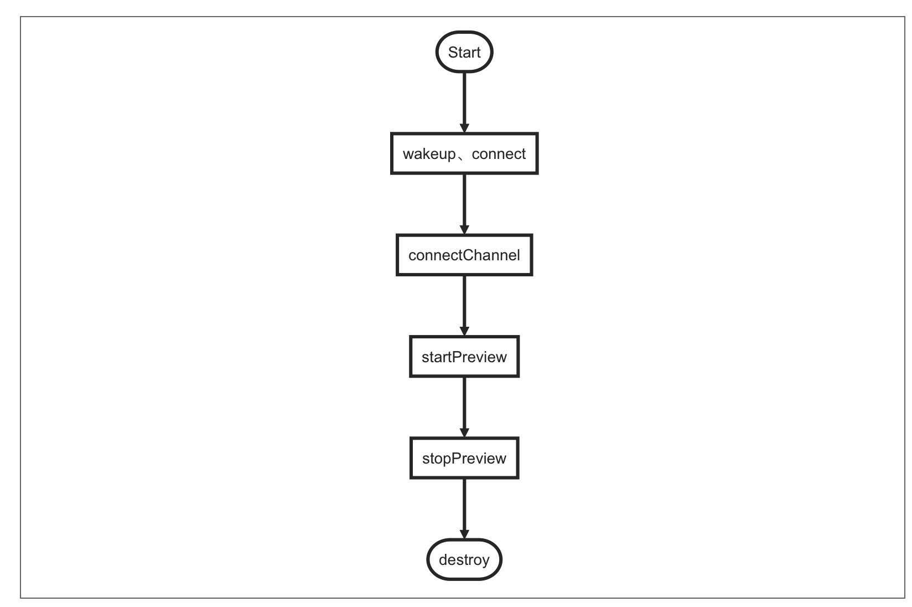

# Low power doorbell wakeUp


Wake-up of Door Bell and Operating Method of Link


```java
mDeviceControl = TuyaCameraDeviceControlSDK.getCameraDeviceInstance(devId);
//wake up
mDeviceControl.wirelessWake(localkey, devId); 
//connect
camera.connect(p2pId, p2pWd,localKey);
```

The flow chart is as follows:



# Door Bell Message
When the device doorbell is pressed, the device will push a message to the App. The current information is pushed from [the system push information](https://tuyainc.github.io/tuyasmart_home_android_sdk_doc/en/resource/MessagePush.html). If the message body carries **type=doorbell**, it can be judged as the doorbell message.

```xml
	{"a":"view","c":"action","cc":"***** ,someone is ringing the bell.","ct":"fcm You have a visitor","devId":"6cfaf335a8d6e752e0wrpy","msgId":"4da4dcf61573555995","p":{"media":13},"specialChannel":false,"ts":"1573555995000","type":"doorbell"}
```


If you want to increase the reach and speed of your messages，you can register doorbell push message listener.

```java
	public class LoginHelper {
    private static final String TAG = "LoginHelper";
    private static ITuyaHomeCamera homeCamera;

    private static ITuyaGetBeanCallback<CameraPushDataBean> mTuyaGetBeanCallback = new ITuyaGetBeanCallback<CameraPushDataBean>() {
        @Override
        public void onResult(CameraPushDataBean o) {
            L.d(TAG, "onMqtt_43_Result on callback");
            L.d(TAG, "timestamp=" + o.getTimestamp());
            L.d(TAG, "devid=" + o.getDevId());
            L.d(TAG, "msgid=" + o.getEdata());
            L.d(TAG, "etype=" + o.getEtype());

        }
    };

    public static void afterLogin() {

        //there is the somethings that need to set.For example the lat and lon;
        //   TuyaSdk.setLatAndLong();
        homeCamera = TuyaHomeSdk.getCameraInstance();
        if (homeCamera != null) {
            homeCamera.registerCameraPushListener(mTuyaGetBeanCallback);
        }
    }

    private static void afterLogout() {
        L.d(TAG, "afterLogout unregister thread " + Thread.currentThread().getName());
        if (homeCamera != null) {
            homeCamera.unRegisterCameraPushListener(mTuyaGetBeanCallback);
        }
        homeCamera = null;
    }


    private static void onLogout(Context context) {
        afterLogout();
        exit(context);
    }

    ...
```

> note: When the app process is killed, the listener is invalid. When the app logs in successfully, register for listener; when the app logs out, cancel the listener

Parameters of message：

| Parameter     | Desc       |
| --------- | ---------- |
| timestamp | message timestamp |
| devid     | devid    |
| msgid     | msgid    |
| etype     | message Type   |

> Note: doorbell message is (etype=doorbell) 

