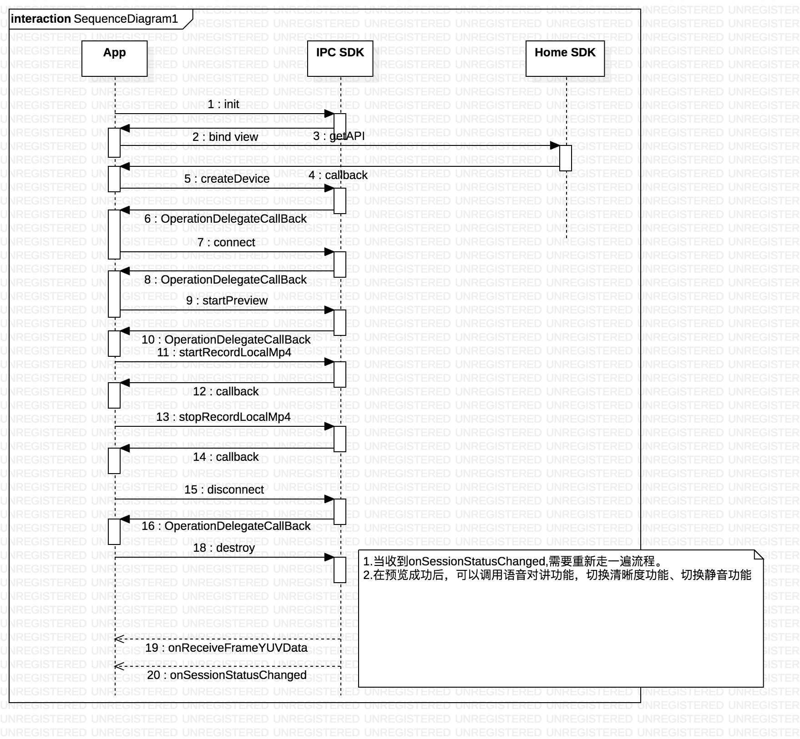

# IPC SDK预览功能方法调用及生命周期


## 示例代码

### 主要链路代码


1. 初始化

   IPC SDK 需要绑定 Monitor，使用者首先要创建 Monitor，并在初始化的时候给绑定到 IPC SDK 中，同时要把 OnP2PCameraListener 注入。如下所示：

   ```java
   private static final int ASPECT_RATIO_WIDTH = 9;
   private static final int ASPECT_RATIO_HEIGHT = 16;
   @Override
   protected void onCreate(Bundle savedInstanceState) {
     ···
     initView();
     initData();
     initListener();
     ...
   }
   ```

   ```java
   private void initView() {
           ...
           mVideoView = findViewById(R.id.camera_video_view);
           ...
   
           //播放器view最好宽高比设置16:9
           WindowManager windowManager = (WindowManager) this.getSystemService(WINDOW_SERVICE);
           int width = windowManager.getDefaultDisplay().getWidth();
           int height = width * ASPECT_RATIO_WIDTH / ASPECT_RATIO_HEIGHT;
           RelativeLayout.LayoutParams layoutParams = new RelativeLayout.LayoutParams(width, height);
           layoutParams.addRule(RelativeLayout.BELOW, R.id.toolbar_view);
           findViewById(R.id.camera_video_view_Rl).setLayoutParams(layoutParams);
   
   }
   ```

   ```java
     private void initData() {
           localKey = getIntent().getStringExtra(INTENT_LOCALKEY);
           devId = getIntent().getStringExtra(INTENT_DEVID);
           sdkProvider = getIntent().getIntExtra(INTENT_SDK_POROVIDER, -1);
           mIsRunSoft = getIntent().getBooleanExtra("isRunsoft", true);
           if (null != TuyaHomeSdk.getUserInstance().getUser()) {
               mlocalId = TuyaHomeSdk.getUserInstance().getUser().getUid();
           }
           mCameraP2P = TuyaSmartCameraP2PFactory.generateTuyaSmartCamera(sdkProvider);
           mDeviceControl = TuyaCameraDeviceControlSDK.getCameraDeviceInstance(devId);
       		mCameraP2P.generateCameraView(mVideoView); //绑定 monitor
           getApi(); //获取设备信息
       }
   ```

   ```java
   private void getApi() {
           Map postData = new HashMap();
           postData.put("devId", devId);
           TuyaHomeSdk.getRequestInstance().requestWithApiName("tuya.m.ipc.config.get", "2.0",
                   postData, new IRequestCallback() {
                       @Override
                       public void onSuccess(Object o) {
                           infoBean = JSONObject.parseObject(o.toString(), CameraInfoBean.class);
                           Log.d("onSuccess", o.toString());
                           mP2p3Id = infoBean.getId(); // not support yet
                           p2pType = infoBean.getP2pSpecifiedType();
                           p2pId = infoBean.getP2pId().split(",")[0];
                           p2pWd = infoBean.getPassword();
                           mInitStr = infoBean.getP2pConfig().getInitStr();
                           mP2pKey = infoBean.getP2pConfig().getP2pKey();
                           mInitStr += ":" + mP2pKey;
                           if (null != infoBean.getP2pConfig().getIces()) {
                               token = infoBean.getP2pConfig().getIces().toString();
                           }
                           initCameraView();
                       }
   
                       @Override
                       public void onFailure(String s, String s1) {
                           ToastUtil.shortToast(CameraPanelActivity.this, "get cameraInfo failed");
                       }
                   });
       }
   ```

   ```java
    //播放模式
      	public static enum PLAYMODE {
              LIVE(0),     //直播
              PLAYBACK(1); //回放
      
              int value;
      
              private PLAYMODE(int value) {
                  this.value = value;
              }
      
              public int getValue() {
                  return this.value;
              }
          }
   ```
2. 初始化回调

   ```java
    private void initCameraView() {
           mCameraP2P.createDevice(new OperationDelegateCallBack() {
               @Override
               public void onSuccess(int sessionId, int requestId, String data) {
                   mHandler.sendMessage(MessageUtil.getMessage(MSG_CREATE_DEVICE, ARG1_OPERATE_SUCCESS));
               }
   
               @Override
               public void onFailure(int sessionId, int requestId, int errCode) {
                   mHandler.sendMessage(MessageUtil.getMessage(MSG_CREATE_DEVICE, ARG1_OPERATE_FAIL));
               }
           }, configCameraBean);
       }
   ```

   

3. connect 连线及 connectChannel 创建通道

   摄像头 p2p 连接操作及回调方法

   ```java
        mCameraP2P.connect(new OperationDelegateCallBack() {
            @Override
            public void onSuccess(int sessionId, int requestId, String data) {
                mHandler.sendMessage(MessageUtil.getMessage(MSG_CONNECT, ARG1_OPERATE_SUCCESS));
            }

            @Override
            public void onFailure(int sessionId, int requestId, int errCode) {
                mHandler.sendMessage(MessageUtil.getMessage(MSG_CONNECT, ARG1_OPERATE_FAIL, errCode));
            }
        });
   ```

4. startPreview 开始播放影像

   摄像头播放影像操作及回调方法

   ```java
     mCameraP2P.startPreview(new OperationDelegateCallBack() {
            @Override
            public void onSuccess(int sessionId, int requestId, String data) {
                Log.d(TAG, "start preview onSuccess");
                isPlay = true;
            }
   
            @Override
            public void onFailure(int sessionId, int requestId, int errCode) {
                Log.d(TAG, "start preview onFailure");
                isPlay = false;
            }
        });
   ```
   > 注意：startPreview 成功回调之后，onReceiveFrameYUVData 回调会开始接收视频数据，并抛给业务层。

5. stopPreview 停止播放影像

   停止摄像头播放影像操作

   ```java
     camera.stopPreview(new OperationDelegateCallBack() {
                @Override
                public void onSuccess(int sessionId, int requestId, String data) {
                    
                }
   
                @Override
                public void onFailure(int sessionId, int requestId, int errCode) {
   
                }
            });
   ```

6. disconnect 断开连线,离开页面的时候可以选择断开 p2p 连接

   ```java
     mCameraP2P.disconnect(new OperationDelegateCallBack() {
                @Override
                public void onSuccess(int sessionId, int requestId, String data) {
                    
                }
   
                @Override
                public void onFailure(int sessionId, int requestId, int errCode) {
   
                }
            });
   ```

7. destroy 销毁对象，不再使用 camera 功能的时候，一定要调用 destroy

   ```java
   TuyaSmartCameraP2PFactory.onDestroyTuyaSmartCamera();   
   ```

>  以上方法调用构成摄像头 live 的生命周期


### 预览开启成功后，可调用信令

#### 开启视频录制

```java
if (Constants.hasStoragePermission()) {
                String picPath = Environment.getExternalStorageDirectory().getAbsolutePath() + "/Camera/";
                File file = new File(picPath);
                if (!file.exists()) {
                    file.mkdirs();
                }
                String fileName = System.currentTimeMillis() + ".mp4";
                videoPath = picPath + fileName;
                mCameraP2P.startRecordLocalMp4(picPath, fileName, CameraPanelActivity.this, new OperationDelegateCallBack() {
                    @Override
                    public void onSuccess(int sessionId, int requestId, String data) {
                        isRecording = true;
                        mHandler.sendEmptyMessage(MSG_VIDEO_RECORD_BEGIN);

                    }

                    @Override
                    public void onFailure(int sessionId, int requestId, int errCode) {
                        mHandler.sendEmptyMessage(MSG_VIDEO_RECORD_FAIL);
                    }
                });
                recordStatue(true);
            } else {
                Constants.requestPermission(CameraPanelActivity.this, Manifest.permission.WRITE_EXTERNAL_STORAGE, Constants.EXTERNAL_STORAGE_REQ_CODE, "open_storage");
            } 
```

> 注：录制视频需要写存储卡权限

#### 停止视频录制

```java
mCameraP2P.stopRecordLocalMp4(new OperationDelegateCallBack() {
                @Override
                public void onSuccess(int sessionId, int requestId, String data) {
                    isRecording = false;
                    //data 返回的是文件路径
                    mHandler.sendMessage(MessageUtil.getMessage(MSG_VIDEO_RECORD_OVER, ARG1_OPERATE_SUCCESS, data));
                }

                @Override
                public void onFailure(int sessionId, int requestId, int errCode) {
                    isRecording = false;
                    mHandler.sendMessage(MessageUtil.getMessage(MSG_VIDEO_RECORD_OVER, ARG1_OPERATE_FAIL));
                }
            });
```

#### 视频截图

```java
if (Build.VERSION.SDK_INT >= Build.VERSION_CODES.KITKAT) {
            String path = Environment.getExternalStorageDirectory().getAbsolutePath() + "/Camera/";
            File file = new File(path);
            if (!file.exists()) {
                file.mkdirs();
            }
            picPath = path;
        }
        mCameraP2P.snapshot(picPath, CameraPanelActivity.this, ICameraP2P.PLAYMODE.LIVE, new OperationDelegateCallBack() {
            @Override
            public void onSuccess(int sessionId, int requestId, String data) {
             //data 返回的是文件路径
                mHandler.sendMessage(MessageUtil.getMessage(MSG_SCREENSHOT, ARG1_OPERATE_SUCCESS, data));
            }

            @Override
            public void onFailure(int sessionId, int requestId, int errCode) {
                mHandler.sendMessage(MessageUtil.getMessage(MSG_SCREENSHOT, ARG1_OPERATE_FAIL));
            }
        });
```

#### 设置拾音器状态

```java
        int mute;
        mute = previewMute == ICameraP2P.MUTE ? ICameraP2P.UNMUTE : ICameraP2P.MUTE;
        mCameraP2P.setMute(ICameraP2P.PLAYMODE.LIVE, mute, new OperationDelegateCallBack() {
            @Override
            public void onSuccess(int sessionId, int requestId, String data) {
            		//data返回的是对应操作之后的结果值
                previewMute = Integer.valueOf(data);
                mHandler.sendMessage(MessageUtil.getMessage(MSG_MUTE, ARG1_OPERATE_SUCCESS));
            }

            @Override
            public void onFailure(int sessionId, int requestId, int errCode) {
                mHandler.sendMessage(MessageUtil.getMessage(MSG_MUTE, ARG1_OPERATE_FAIL));
            }
        });
```

#### 开启对讲

```java
if (Constants.hasRecordPermission()) {
                mCameraP2P.startAudioTalk(new OperationDelegateCallBack() {
                    @Override
                    public void onSuccess(int sessionId, int requestId, String data) {
                        isSpeaking = true;
                        mHandler.sendMessage(MessageUtil.getMessage(MSG_TALK_BACK_BEGIN, ARG1_OPERATE_SUCCESS));
                        ToastUtil.shortToast(CameraPanelActivity.this, "start talk success");
                    }

                    @Override
                    public void onFailure(int sessionId, int requestId, int errCode) {
                        isSpeaking = false;
                        mHandler.sendMessage(MessageUtil.getMessage(MSG_TALK_BACK_BEGIN, ARG1_OPERATE_FAIL));
                        ToastUtil.shortToast(CameraPanelActivity.this, "operation fail");

                    }
                });
            } else {
                Constants.requestPermission(CameraPanelActivity.this, Manifest.permission.RECORD_AUDIO, Constants.EXTERNAL_AUDIO_REQ_CODE, "open_recording");
            }
```


 #### 停止对讲

```java
mCameraP2P.stopAudioTalk(new OperationDelegateCallBack() {
                @Override
                public void onSuccess(int sessionId, int requestId, String data) {
                    isSpeaking = false;
                    mHandler.sendMessage(MessageUtil.getMessage(MSG_TALK_BACK_OVER, ARG1_OPERATE_SUCCESS));
                }

                @Override
                public void onFailure(int sessionId, int requestId, int errCode) {
                    isSpeaking = false;
                    mHandler.sendMessage(MessageUtil.getMessage(MSG_TALK_BACK_OVER, ARG1_OPERATE_FAIL));

                }
            });
```

> 注：对讲和录制是互斥的，而且只有在预览时可以开启对讲。


#### 获取清晰度

```java
mCameraP2P.getVideoClarity(new OperationDelegateCallBack() {
            @Override
            public void onSuccess(int sessionId, int requestId, String data) {
                
            }

            @Override
            public void onFailure(int sessionId, int requestId, int errCode) {

            }
        });
```

> 注意：预览画面出来后，调取该函数

#### 设置清晰度

```java
 mCameraP2P.setVideoClarity(videoClarity == ICameraP2P.HD ? ICameraP2P.STANDEND : ICameraP2P.HD, new OperationDelegateCallBack() {
            @Override
            public void onSuccess(int sessionId, int requestId, String data) {
                videoClarity = Integer.valueOf(data);
                mHandler.sendMessage(MessageUtil.getMessage(MSG_GET_CLARITY, ARG1_OPERATE_SUCCESS));
            }

            @Override
            public void onFailure(int sessionId, int requestId, int errCode) {
                mHandler.sendMessage(MessageUtil.getMessage(MSG_GET_CLARITY, ARG1_OPERATE_FAIL));
            }
        });
```

#### 清晰度模式

```java
public interface ICameraP2P<T> {
       /**
       * 高清
       */
      int HD = 4;
      /**
       * 标清
       */
      int STANDEND = 2;
      ...
          
      }


```

## 时序图



